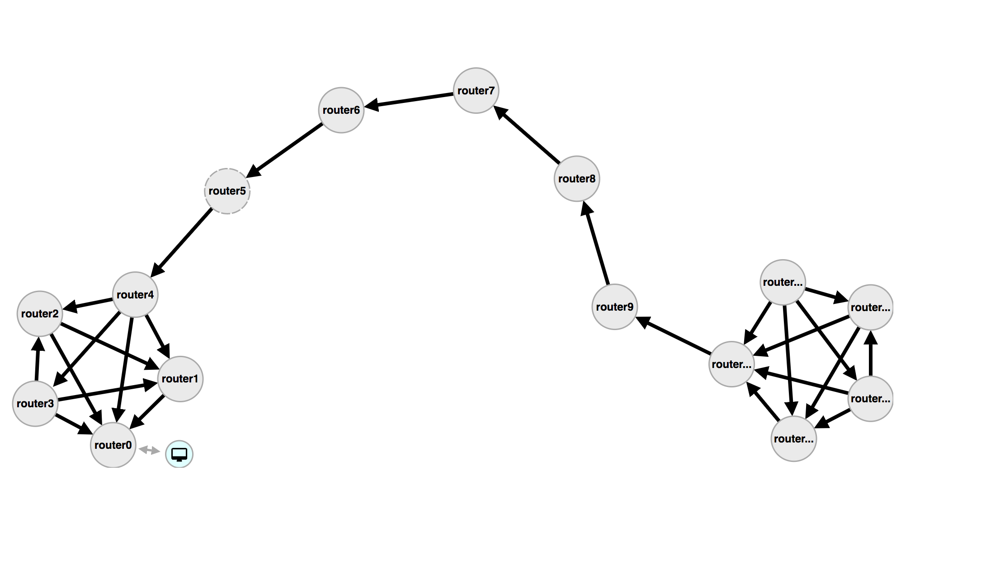

# qpid dispatch topology generator

## Generate your configurations

```
python generator.py
```

## Deploy it

```
vagrant up
```

## Access the gui

Browse to `http://192.168.11.2:8000`

Enjoy the topology or generate a new one : 

Barbell graph (5x5):



# Iteration

```
python generator.py
vagrant provision
vagrant ssh -c "docker ps -aq | xargs docker stop"
vagrant ssh -c "docker ps -aq | xargs docker rm"

